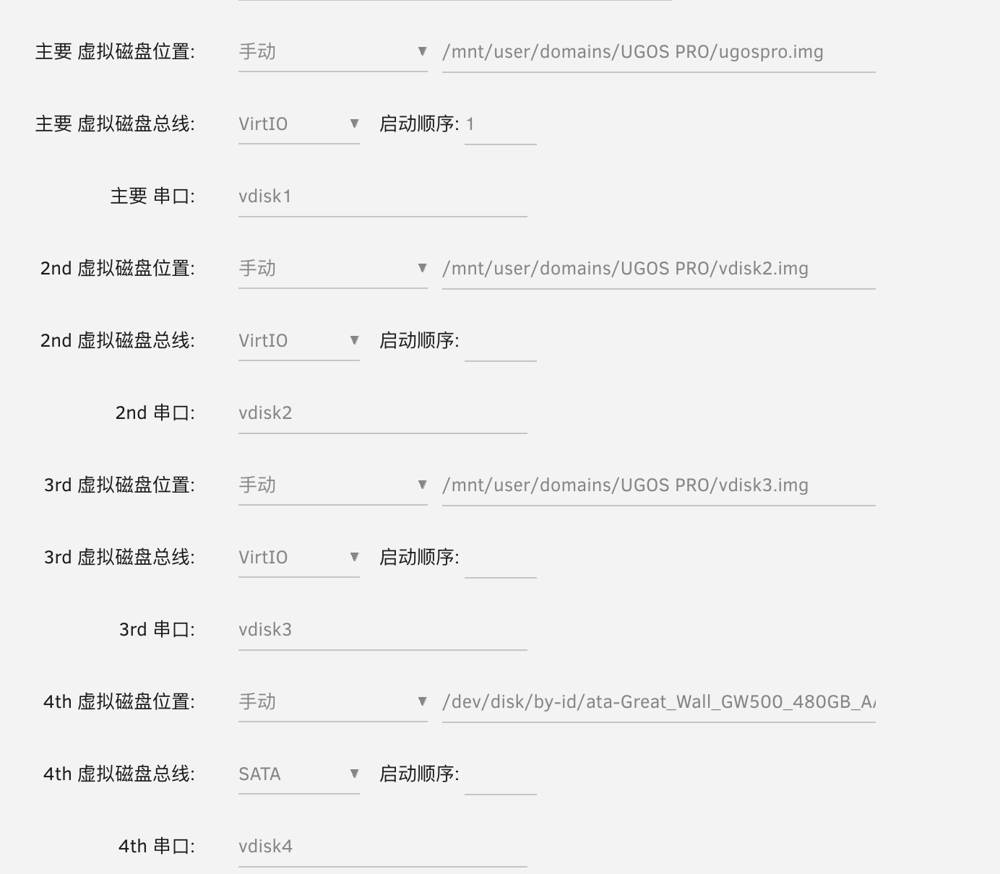

# dxp4800_pve
pve安装dxp4800虚拟机，解决在线更新系统问题

# 新增boot启动磁盘
1. pve新增2个磁盘，大小都给0.004G
2. 用dd命令把2个存储启动信息的分区传输给新建的2个虚拟磁盘
```shell
dd if=/dev/mmcblk0boot0 of=/dev/mapper/pve-vm--100--disk--2
dd if=/dev/mmcblk0boot1 of=/dev/mapper/pve-vm--100--disk--3
```

unraid磁盘分配参考, pve也类似
# 创建虚拟磁盘的映射
## 查看磁盘总线地址 (弃用)
   ```shell
     ssh进绿联虚拟机执行下面命令
     lsscsi
     输出：
        [1:0:0:0]    cd/dvd  QEMU     QEMU DVD-ROM     2.5+  /dev/sr0
        [6:0:0:0]    disk    ATA      QEMU HARDDISK    2.5+  /dev/sda
        [7:0:0:0]    disk    ATA      QEMU HARDDISK    2.5+  /dev/sdb
        [8:0:0:0]    disk    ATA      QEMU HARDDISK    2.5+  /dev/sdc
     或者执行： udevadm info -q path -n /dev/sdb
     输出：
     /devices/pci0000:00/0000:00:1e.0/0000:05:01.0/0000:06:07.0/ata8/host7/target7:0:0/7:0:0:0/block/sdb
   
   6:0:0:0就是sda磁盘的总线，每次重启sda，sdb可能都会变，要用固定不变的总线做条件映射
  ```
## 查看磁盘文件描述符
```shell
$ lsblk
vda                                      254:0    0    32G  0 disk  
├─vda1                                   254:1    0   256M  0 part  /boot
├─vda2                                   254:2    0     2G  0 part  /rom
├─vda3                                   254:3    0    10M  0 part  /mnt/factory
├─vda4                                   254:4    0     2G  0 part  
├─vda5                                   254:5    0     2G  0 part  
├─vda6                                   254:6    0     4G  0 part  /ugreen
└─vda7                                   254:7    0  18.9G  0 part  /overlay
vdb                                      254:16   0     4M  0 disk  
vdc                                      254:32   0     4M  0 disk 
```
## 创建udev规则，每次开机自动给磁盘一个SYMLINK

  - 查询需要用到的信息
    ```shell
    # 说明: /dev/vda是我的系统安装盘, 虚拟磁盘总线我选择的virtio, 需要创建存储的磁盘选sata或者直通, 否则绿联系统识别不到
    $ udevadm info --query=all --name=/dev/vda | grep DEVTYPE
    E: DEVTYPE=disk
    $ udevadm info --query=all --name=/dev/vda | grep ID_SERIAL
    E: ID_SERIAL=vdisk1
    .... 其他需要映射的磁盘自己一一对应 --name=/dev/vda1, --name=/dev/vda2..., --name=/dev/vdb, --name=/dev/vdc, 举一反三
    ```
  - 创建文件 ~~/etc/udev/rules.d/10-rename-disks.rules~~ /etc/udev/rules.d/999-rename-disks.rules, 名字的前缀数字尽量大
    用vim编辑器编辑这个文件，填入下面代码
  
      ```bash
        # 这种写法弃用
        KERNELS=="6:0:0:0", SYMLINK+="mmcblk0"
        KERNELS=="7:0:0:0", SYMLINK+="mmcblk0boot0"
        KERNELS=="8:0:0:0", SYMLINK+="mmcblk0boot1"
        KERNELS=="6:0:0:0", KERNEL=="sd?[1-7]", SUBSYSTEMS=="scsi", ATTRS{scsi_level}=="6", SYMLINK+="mmcblk0p%n"

        # 使用新的规则
        SUBSYSTEM=="block", ENV{ID_SERIAL}=="vdisk1",ENV{DEVTYPE}=="disk", SYMLINK+="mmcblk0"
        SUBSYSTEM=="block", ENV{ID_SERIAL}=="vdisk1",ENV{DEVTYPE}=="partition", SYMLINK+="mmcblk0p%n"
        SUBSYSTEM=="block", ENV{ID_SERIAL}=="vdisk2",ENV{DEVTYPE}=="disk", SYMLINK+="mmcblk0boot0"
        SUBSYSTEM=="block", ENV{ID_SERIAL}=="vdisk3",ENV{DEVTYPE}=="disk", SYMLINK+="mmcblk0boot1"
      ```

  - 执行命令： `udevadm control --reload-rules && udevadm trigger` 让规则生效
  - `udevadm test /sys/block/vda` 查看规则执行情况
  执行 `ls -l /dev/mmc*` 
  ```shell
    $ ls -l /dev/mmc*
    lrwxrwxrwx 1 root root 3 Jul 19 11:24 /dev/mmcblk0 -> vda
    lrwxrwxrwx 1 root root 3 Jul 19 11:24 /dev/mmcblk0boot0 -> vdb
    lrwxrwxrwx 1 root root 3 Jul 19 11:24 /dev/mmcblk0boot1 -> vdc
    lrwxrwxrwx 1 root root 4 Jul 19 11:24 /dev/mmcblk0p1 -> vda1
    lrwxrwxrwx 1 root root 4 Jul 19 11:24 /dev/mmcblk0p2 -> vda2
    lrwxrwxrwx 1 root root 4 Jul 19 11:24 /dev/mmcblk0p3 -> vda3
    lrwxrwxrwx 1 root root 4 Jul 19 11:24 /dev/mmcblk0p4 -> vda4
    lrwxrwxrwx 1 root root 4 Jul 19 11:24 /dev/mmcblk0p5 -> vda5
    lrwxrwxrwx 1 root root 4 Jul 19 11:24 /dev/mmcblk0p6 -> vda6
    lrwxrwxrwx 1 root root 4 Jul 19 11:24 /dev/mmcblk0p7 -> vda7
  ```
  完美
  - `udevadm test /sys/block/vda` 查看规则执行情况(如果没生效)
# pve设置BIOS的sn和uuid
- 查询sn和uuid
  ssh进pve执行
  ```shell
  dmidecode -s system-uuid    # uuid
  dmidecode -s system-serial-number    # sn
  ```

- pve修改BIOS信息
  选项-SMBIOS设置，只填uuid和串行（就是sn），**不要泄露sn**

重启，OK。

# pve中控制4800的6个灯

参考这个仓库： https://github.com/miskcoo/ugreen_dx4600_leds_controller
发现ssh会自动把端口给关闭参考矿神博客：  https://imnks.com/10101.html